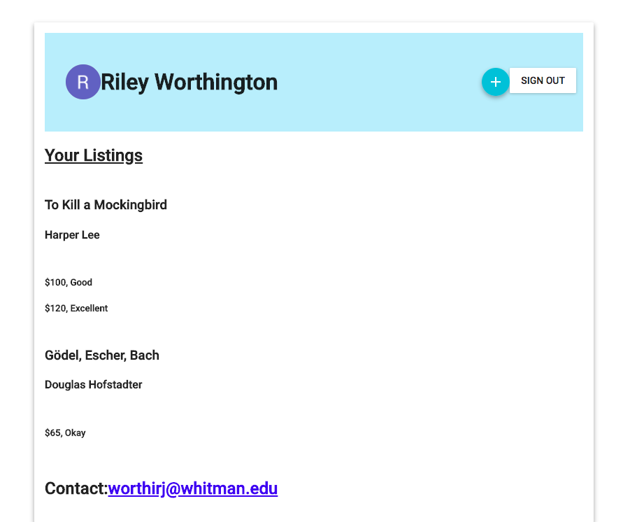
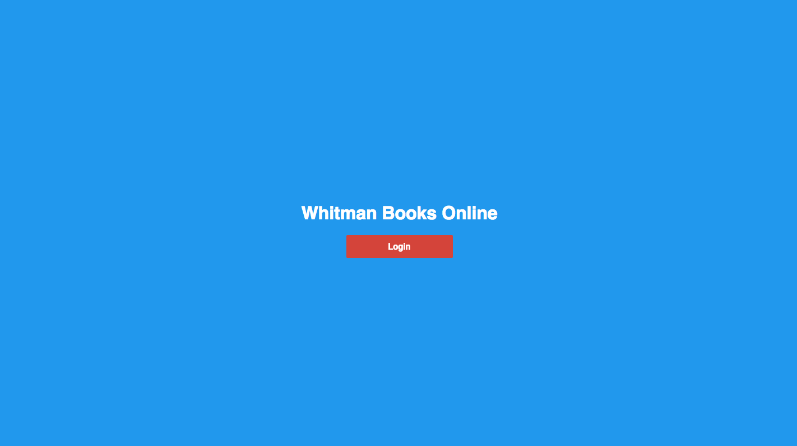
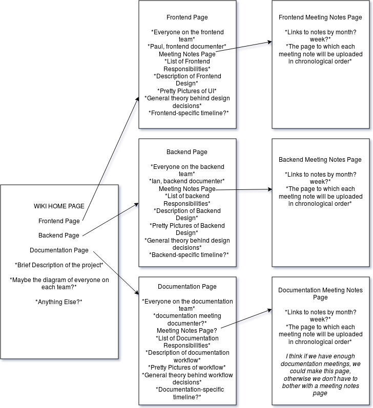
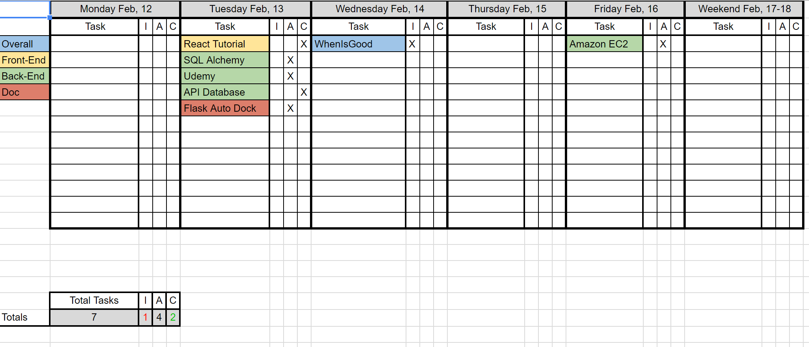

===============
Design Document
===============
*Converted to reStructuredText by Isaiah Banta*

Completed: 04/03/2018

Objective
---------

As stated in our requirements document, the objective of this project is to develop a web application to facilitate the sale and/or exchange of textbooks between students at Whitman College. The minimum viable product (MVP) will contain at least the following four functionalities:

- Create and log in to a user account.
- List a book for sale.
- Search for books.
- Reserve a book.

See our requirements document for more details on each of these items.

Team
----
**Organizational Chart**

.. image:: ../../images/org_chart.png

Front-End
---------
User Stories
^^^^^^^^^^^^

**Seller**
As a **seller**, I want to **list my books** so that **I can sell them to people at Whitman with ease.**

**Buyer**
As a **buyer**, I want to **find books I need** so that **I can buy them easily from people at Whitman**.

Use Case Diagram
^^^^^^^^^^^^^^^^

.. image:: ../../images/uml_use_case.png

User Interfaces
^^^^^^^^^^^^^^^
**User Profile**

**Login Page**

Search
^^^^^^
**Initiating a Search**
To initiate a search, the user will simply have to type in the name of the book they are looking for in the provided search bar, towards the top of the application.

**Display of Search Results**
Once the user has entered in what they are searching for, they will see a general listing corresponding to the book they are looking for. These results do not correspond to individual listings from sellers. Similar to Amazon's marketplace, the user sees the general listing for the product they are looking for.

**Listings**
Once the user has selected a general listing, different sellers for that product will be shown.These correspond to individual entries by sellers.The user can proceed from those individual listings to communicate with the seller to organize a purchase.

Components
^^^^^^^^^^
Our application will be designed using declarative, composable pieces called Components. Putting these components together will form the view of our application. These components will interact with our controller, allowing the user to have meaningful interactions with our Back-End, which will form the model.

**Component List**
<App />

<Page />

- A wrapper that displays content on the user's screen.

<Login />

- Handles user login information to determine valid login credentials and give access to profile if valid.

<Navigation />

- Accesses components selected by the user.

<Profile />

- Displays user's profile information.

<Market />

- Displays list of book listings currently for sale.

<SellBook />

- Processes user input of book being listed for sale, posting to Market's page

<Search />

- Searches through listed books.

<BookFeed />

- List of books displayed on the Market's page

<BookItem />

- Stores user input of books for sale contained in BookFeed's list of books.

<BookPage />

- Page used to display BookItem information.

<ListingFeed />

- List of book listings for a specific book.

<ListingItem />

- Individual listing of a book with price and selling information attached.

<BuyBook />

- Handles user's purchase of a book, processing payment and removing the book's listing if paid for.

<ListingPage />

- Page used to display ListingItem information.

<SellerPage />

- Page pulled from a user profile to be viewed by other users that displays past sales history.

Back-End
--------
Infrastructure
^^^^^^^^^^^^^^
**Server**
We will be using two CentOS 7 servers with private networking. The app server will run the Node.js runtime, the application, and PM2, which is a process manager, and the web server will run Nginx which will work as a reverse proxy to the application. This server is also how users will access the application.

Databases
^^^^^^^^^

**Frameworks**
- Flask - to connect our API
- Flask SQLAlchemy - SQLAlchemy is an SQL toolkit for the Python language.

**Information in the Database**
- Users - All of the users of Whitman Books Online.
- Books - All of the current book listings on Whitman Books Online.

**Method of Collection**
- Users - Ideally retrieve user information using their Whitman ID, each user should have a unique ID.
- Books - User inputted information, collected while creating a listing.

Search Algorithms and Implementation
^^^^^^^^^^^^^^^^^^^^^^^^^^^^^^^^^^^^
**Fuzzy Search for Lookups & Extending in C**
Database lookups will likely constitute the majority of our processing requirements. Thus, it is important to have a efficient way of matching an item in our database to a textbook a user is trying to access. Due to long textbook titles and the high probability that the average user won’t know the ISBN of the book they are looking for, we need a search method that doesn’t require the user know the exact name their target. We implement numerous fuzzy matching techniques to guess the exact entry from possible misspellings. The first is Levenshtein distance, getting an exact number of character distances from a pre-hashed list of possible spellings of all of our entries. We also implement a trigram search, breaking up each term into randomly sized substrings, and searching those through our database. We will not implement Metaphone or its derivatives as it is unlikely that a user will mistake a “p” for a “b” or like errors in typing the textbook they are looking for. For all of these to work with reasonable speed they should not be implemented in Python. We will use the subprocess module to spawn pre-compiled C++ programs for the obvious speed advantages. As the speed requirements of our program become more apparent (server selection) other implementations may need consideration. It is possible that the native library search functions will be adequate given enough processing power.

Classes
^^^^^^^
- ListingModel - includes "helper" functions for the Listing class

- Listing - objects have a listing id, price, user id, book id, condition (good, poor, fair), and status (sold/not sold)

- Listing class also supports get, put, post, and delete http requests, which interacts with the listing table in the database

- The Book and User classes follow the same framework . . .

API
^^^
**List of API Functions**
The API is being designed to accommodate all frontend needs and will update and retrieve data from the database. Currently, the items stored in the database are simple: just an item with a price. This will be changed to accommodate book objects, with the following corresponding database columns: title, author name, price, Listing ID, ISBN, Whitman class. The book objects will also be related to users in our user table:

- GET - returns all items in the database
- GET(item) - returns all information stored in the database about the item.
- POST(item) - This function adds an item to the database, does nothing if the item already exists in the database.
- PUT(item, price) - this will be the most commonly used API function. If the item does not exist in the database, the item gets added to the database along with the price. If the item exists in the database, the PUT function will update the item in the database with the current price. If the item already exists and has the same price, nothing will change.
- DELETE(item) - If an item exists in the database, the item gets removed from the database.

Similar functions will have to be implemented for the users.

The API also incorporates two functions for security via the JWT library:

- REGISTER - takes a username and password, saves it to the user table, and prints an error message if the user already exists or if there is a problem with the username or password.
- AUTHENTICATE - takes a valid username and password, and generates a security token that is required in order to call GET, POST, DELETE, etc.

Documentation
-------------
Documentation Plan
^^^^^^^^^^^^^^^^^^
**Sphinx**
We are using the Sphinx Documentation Tool and an associated Read The Docs page that will be fleshed out as we build the application itself.

**Data Flow**
Following a team meeting, the respective team documenter will update the wiki with new tasks and a summary of the meeting itself. The following steps outline the process of adding information to the wiki This document is intended to suggest to documentation team members how to update the wiki with new tasks after a meeting.

- Take notes from the meeting
  a. Convert notes to reStructuredText
- Make a new wiki page or add to the one already created in /docs/source/meeting/
  a. Meeting note file names should be named like so YYYY-MM-DD.rst, for example, 2018-01-30.rst
- For each task in the meeting notes, create a new GitHub issue
  a. Assign it to the person most responsible for it
  b. Add as much detail as possible from the meeting notes and specify any additional people working on that ticket
  c. Tag the issue with any relevant labels and add it to a milestone (if applicable)
- Notify Kyler about anything that would affect the big-picture schedule
  
**Meeting Structure**

.. image:: ../../images/meeting_structure.png

Although the file structure has changed since the creation of the wiki flow chart below, the information on this image is still relevant in what each team's documenter should have in mind when writing team meeting notes.

**Wiki Organization**

Below are the team roles that were decided upon on January 30th.

**Documentation Team Roles**

+--------+--------------------------------------------------+
| Person | Responsibilities                                 |
+========+==================================================+
| Jeremy | team leader, wiki organizer                      |
+--------+--------------------------------------------------+
| Paul	 | front-end documenter                             |
+--------+--------------------------------------------------+
| Ian	 | back-end documenter                              |
+--------+--------------------------------------------------+
| Kirk	 | documentation documenter (so meta), wiki manager |
+--------+--------------------------------------------------+
| Kyler	 | schedule and issues manager                      |
+--------+--------------------------------------------------+
| Tyler	 | special documents writer                         |
+--------+--------------------------------------------------+

Schedule
--------
Master Schedule
^^^^^^^^^^^^^^^
As I continued working on the weekly schedules we (I) realized that people were more interested when large project issues were to be finished. I went around checking in with people on what sort of schedule they would like the most out of the Scheduling Manager. They really liked the Whitman College academic calendar. I made essentially the same schedule as the Whitman Academic Calendar and put in our own assignments and due dates. *~Kyler Dunn*

**Master Schedule**

.. image:: ../../images/master_schedule.jpg

+----------------------------+------------------------------+
| Date                       | Assigned                     |
+============================+==============================+
| Wednesday, March 7th, 2018 | Design Phase Document Due    |
+----------------------------+------------------------------+
| Monday, March 26th, 2018   | Implementation Phase Begins  |
+----------------------------+------------------------------+
| Tuesday, April 17th, 2018  | MVP Due                      |
+----------------------------+------------------------------+
| Tuesday, April 24th, 2018  | User Testing Begins          |
+----------------------------+------------------------------+
| Thursday, May 10th, 2018   | Estimated Final Rollout      |
+----------------------------+------------------------------+

Weekly Schedules
^^^^^^^^^^^^^^^^
As the Schedule Manager for this project, I took it upon myself to sort of track what each group was doing over each week. This was to be used not only to aid in keeping people up to date but also for Mr. Banta to know where each team is at. The information tracked on the schedule would be used at overall project meetings so that everyone is aware where people are at during the design phase. ~ Kyler Dunn

**Week Four**

.. image:: ../../images/week_four_tasks.PNG

**Week Five**

**Week Six**

.. image:: ../../images/week_six_tasks.PNG

**Week Seven**

.. image:: ../../images/week_seven_tasks.PNG

Map of Requirements for Implementation
--------------------------------------

User Account
^^^^^^^^^^^^
All users will be required to create an account with Whitman Books Online before they are allowed to buy/sell, create a listing, or view other listings.

All users will require a whitman email to create an account. This is so that users are confident that they are interacting with their peers, and as a safety precaution.

List a Book for Sale
^^^^^^^^^^^^^^^^^^^^
Listing a book requires an account, and to be logged in.

The minimum values required to list a book are:

- ISBN
  - This ISBN is used with a lookup service to gather data on:
    - Title
    - Author
    - Edition
    - etc.
  - Price
  - Condition

Search for Books
^^^^^^^^^^^^^^^^
Searching for a book is a main feature of the Whitman Books Online service. A search bar will be prominently displayed on the home page and at the top of subpages, from which users can enter queries for the following attributes:

- Title
- Author
- Class
- Subject
The search will query the database and receive back a list of relevant books. The search will include an autocomplete feature to predict search terms as the user enters them. Once the list of results is displayed, users will be able to filter by Popularity, Subject, Date Added, and Price to further narrow down their search.

Reserve a Book
^^^^^^^^^^^^^^
The process for reserving a book is as follows.

1. Locate book in the database

2. Choose copy you wish to buy

3. Click "Buy" button, triggering the launch of mail client to contact seller

4. Arrange to meet with seller outside of the app

5. Book remains listed until seller closes the transaction

Security Plan
^^^^^^^^^^^^^
Security questions within the application will likely be questions about authentication and user storage. While users will be stored in the database, our plan is to not store any authentication details, largely to minimize our security risks. This will be made possible by using Google OAuth 2.0 to identify users to the application, allowing us to only store something like an email address with which we can correlate Google users to application users. This will also allow us to limit logins to people with valid Whitman accounts.

Security from an operations perspective will try to provide for threats from generic unscrupulous users. Treating the application as a black box, such security will have two primary components: security for the server from unauthorized users and security between the application and the user. The first will be provided for with standard server security measures: key-based ssh auth, a maximally locked-down firewall, etc. If we get the budget for the required EC2 instances, we could even host the frontend service on an edge server, leaving backend+DB on another instance locked down to the public. As for the security between the server and users, we will use HTTPS for all public connections, only allowing unencrypted HTTP URIs to redirect to their HTTPS counterparts. This should adequately provide security between the user and the application.

Testing
-------
Front End
^^^^^^^^^
The Front-End will use the Jasmine testing framework to write and run our tests. We will focus our tests on the functions that interact with our Back-End and other services and will make sure all tests pass before opening pull requests to the master repo.

Jasmine.js

An example of the kind of test we would write.

.. highlight:: javascript

   describe("A suite is just a function", () => {
        var a;

        it("and so is a spec", () => {
        a = true;

        expect(a).toBe(true);
        });
   });

Back End
^^^^^^^^
Backend will use the unittest Python module to write unit tests. Just like the front end, we will ensure that all back-end tests pass before any merges into master.
