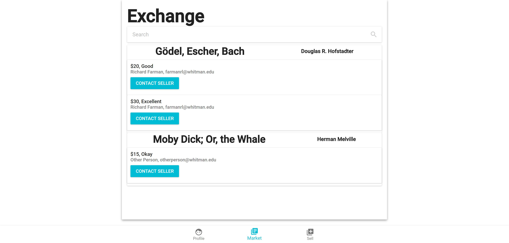
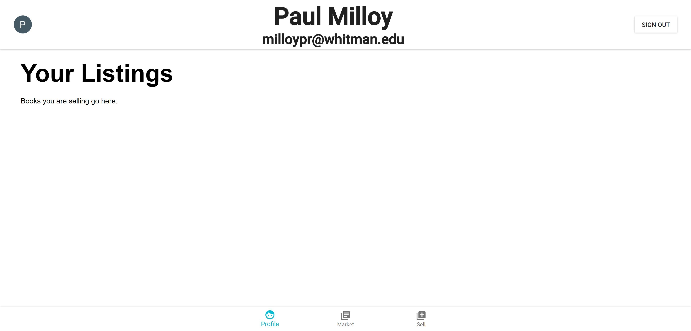
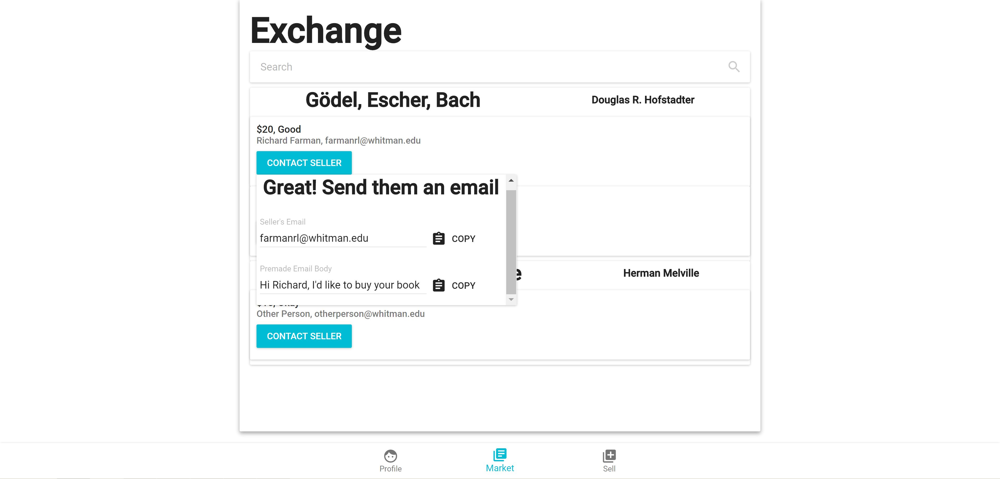
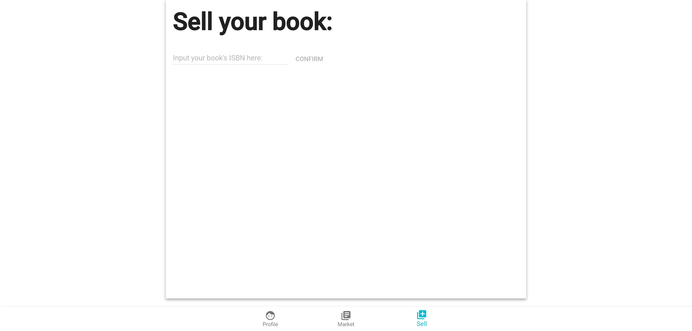
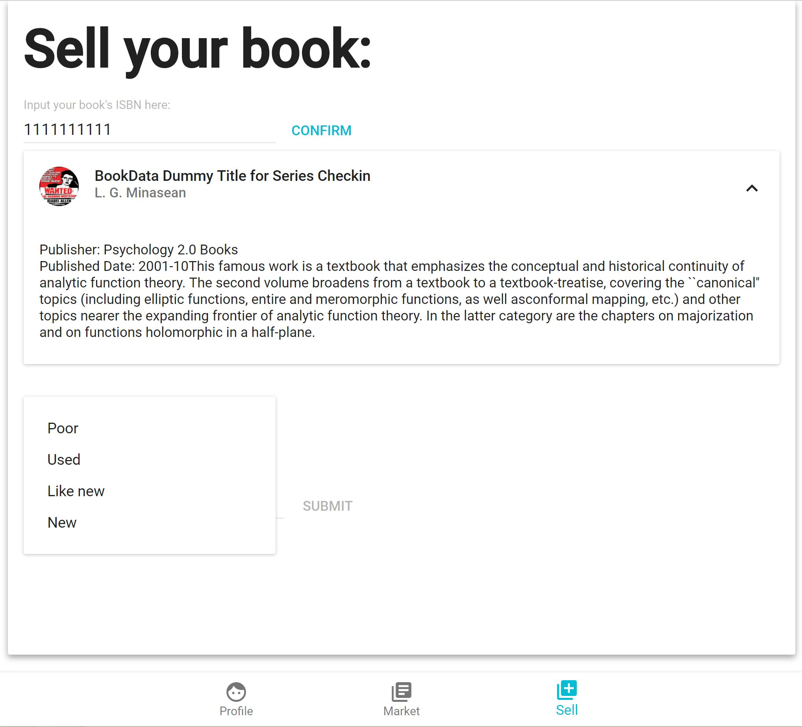
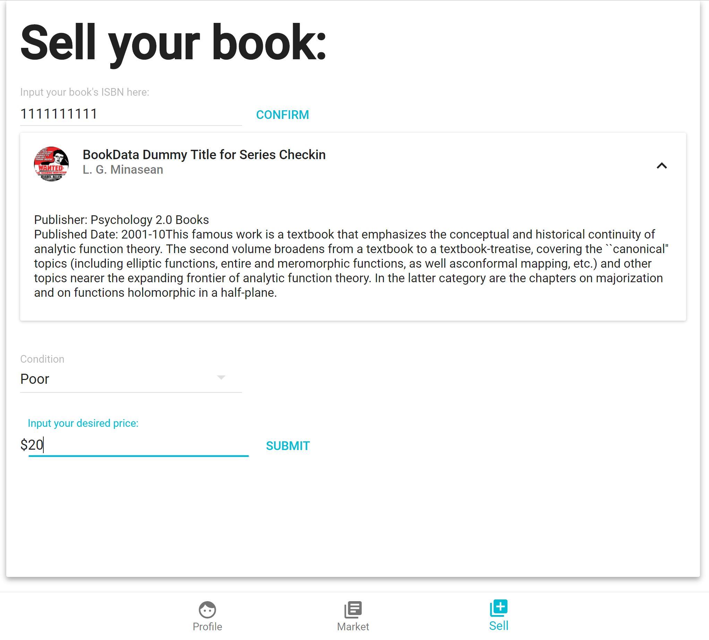

----------
Login Page
----------

- Clicking the login button opens a prompt
- This service is exclusively for Whitman students and requires you to use a Whitman email account
- Your user profile is created automatically from your Whitman account

---------------------
Navigating the Market
---------------------

- The Market tab displays all listings posted of books for sale
- Each listing displays the title of the book, the author of the book, the price and condition of the book being sold, the name and email of the Whitman student who posted the listing and a Contact Seller button to contact that student and ask to purchase their book
- Listings can be navigated using the Search tab (\*Currently not functioning, Advanced Search to be added)

-----------------------
Navigating your Profile
-----------------------

- Click on the Profile tab at the bottom of the screen to navigate to your profile
- Your Profile page will display all of the listings you have posted to the market (\*Currently books you fill out to sell will not be added under your listings)

-------------
Buying a Book
-------------

- Click on Contact Seller
- A drop-down menu will appear that includes both the seller’s email and a pre-made email message asking to purchase the book they’ve listed. 
- Clicking the Copy button next to the email or pre-made message to copy either
- In your email, paste the message into the body of the email and send the email to the email address of the seller
- Wait for a response from the seller to coordinate buying their book!

--------------
Selling a Book
--------------

- Click on the Sell tab at the bottom of the screen
- A prompt appears requesting an ISBN for the book you are trying to sell. This can typically be found on the back cover of the book 
.. image:: ../../images/sell_page-inputting_isbn.png
- Adding the ISBN will bring up a publisher description of the book you are trying to sell. Confirm that the description matches the book you are selling before continuing. If it does not, double-check that you have added the correct ISBN

- Choose from the Condition drop down menu the option that best describes the condition of your book. Be accurate and honest in choosing the most apt description.

- Finally, add the Price you are wishing to sell the book for. Be sure to only add numbers into this prompt in order to have a valid price.
- After clicking submit, a listing for your book will appear in the market! (\*Currently not working, will be added)
